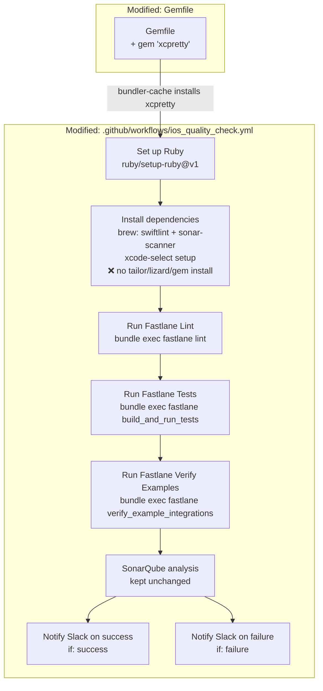

# [iOS SDK] PR Quality Check — Fastlane, Ruby Setup & Slack — Design

**Spec:** `.specs/features/DEV-305935-ios-sdk-pr-quality-fastlane/spec.md`  
**Context:** `.specs/features/DEV-305935-ios-sdk-pr-quality-fastlane/context.md`  
**Status:** Approved

---

## Architecture Overview

Medium-surgical scope: 2 files modified, 0 new infrastructure files, no complex architectural decisions. All changes are additive or direct replacements within existing files.



**Full step ordering diagram (`ios_quality_check.yml` after refactor):**

```
[unchanged] Checkout code
[unchanged] Get Git Revision
[unchanged] Setup Xcode (maxim-lobanov/setup-xcode)
[NEW]       Set up Ruby (ruby/setup-ruby@v1, ruby-version: '3.4', bundler-cache: true)
[MODIFIED]  Install dependencies (remove: tailor, lizard, gem install xcpretty | keep: swiftlint, sonar-scanner, xcode-select)
[unchanged] Reset SonarScanner cache
[unchanged] Update sonar properties
[NEW]       Run Fastlane Lint        → bundle exec fastlane lint
[NEW]       Run Fastlane Tests       → bundle exec fastlane build_and_run_tests
[NEW]       Run Fastlane Verify Examples → bundle exec fastlane verify_example_integrations
[unchanged] Run Sonar-Swift Script
[unchanged] Verify Coverage Report
[NEW]       Notify Slack on success  (if: success())
[NEW]       Notify Slack on failure  (if: failure())
```

---

## Code Reuse Analysis

### Existing Components to Leverage

| Component | Location | How to Use |
|---|---|---|
| `actions/checkout` SHA pin | `ios_quality_check.yml:28` | Unchanged |
| `maxim-lobanov/setup-xcode` | `ios_quality_check.yml:42` | Unchanged |
| `Get Git Revision` step | `ios_quality_check.yml:32-38` | Unchanged — required for `sonar.scm.revision` |
| `Update sonar properties` step | `ios_quality_check.yml:70-79` | Unchanged — ticket: "Keep SonarQube property injection" |
| `Run Sonar-Swift Script` step | `ios_quality_check.yml:86-91` | Unchanged — ticket: "Keep scan, and coverage verification" |
| `Verify Coverage Report` step | `ios_quality_check.yml:93-100` | Unchanged — explicit ticket edge case |
| `fastlane lint` lane | `fastlane/Fastfile:66-71` | Invoked via `bundle exec fastlane lint` |
| `fastlane build_and_run_tests` lane | `fastlane/Fastfile:14-21` | Invoked via `bundle exec fastlane build_and_run_tests` |
| `fastlane verify_example_integrations` lane | `fastlane/Fastfile:60-63` | Invoked via `bundle exec fastlane verify_example_integrations` |
| Slack YAML payload | Ticket DEV-305935 | Used verbatim from the ticket |

### Integration Points

| System | Integration Method |
|---|---|
| Slack | `slackapi/slack-github-action@v2` via `incoming-webhook`; webhook URL from `secrets.SLACK_WEBHOOK_URL` |
| SonarQube | Unchanged — `run-sonar-swift.sh` + `sonar-project.properties` |
| Ruby/Bundler | `ruby/setup-ruby@v1` manages Ruby 3.4 + gems via Gemfile |

---

## Components

### Change 1: `Gemfile`

- **Purpose:** Add `xcpretty` as a Bundler-managed dependency to eliminate `sudo gem install` from the YAML
- **Location:** `Gemfile`
- **Change:** Add `gem 'xcpretty'` after `gem 'fastlane'`
- **Reuses:** Existing Gemfile pattern

---

### Change 2: `ios_quality_check.yml` — `Set up Ruby` step (NEW)

- **Purpose:** Configure Ruby 3.4 with gem cache via Bundler
- **Location:** `.github/workflows/ios_quality_check.yml`
- **Insert after:** `Setup Xcode` step
- **Content:**
  ```yaml
  - name: Set up Ruby
    uses: ruby/setup-ruby@v1
    with:
      ruby-version: '3.4'
      bundler-cache: true
  ```

---

### Change 3: `ios_quality_check.yml` — `Install dependencies` step (MODIFIED)

- **Purpose:** Remove tools now managed by Bundler and remove unused tailor/lizard
- **Location:** `.github/workflows/ios_quality_check.yml:46-59`
- **Remove:** `brew install tailor`, `brew install lizard`, `sudo gem install -n /usr/local/bin xcpretty`
- **Keep:** `brew update`, `brew install swiftlint`, `sudo xcode-select -switch`, `sudo xcodebuild -license accept`

---

### Change 4: `ios_quality_check.yml` — Fastlane lane steps (NEW)

- **Purpose:** Fastlane lanes as authoritative test paths, fast-failing before SonarQube
- **Location:** `.github/workflows/ios_quality_check.yml` — insert after `Update sonar properties`, before `Run Sonar-Swift Script`
- **3 steps**, none with `continue-on-error`

---

### Change 5: `ios_quality_check.yml` — Slack notifications (NEW)

- **Purpose:** Notify the team in Slack of the build result in real time
- **Location:** `.github/workflows/ios_quality_check.yml` — insert at end of job (after `Verify Coverage Report`)
- **2 steps** (payload verbatim from the ticket):
  - `Notify Slack on success` with `if: success()`
  - `Notify Slack on failure` with `if: failure()`

---

## Data Models

N/A — no data models. CI configuration only.

---

## Error Handling Strategy

| Error Scenario | Handling | CI Impact |
|---|---|---|
| `bundle exec fastlane lint` fails | Step exits non-zero → job stops immediately | PR blocked; Slack failure sent |
| `bundle exec fastlane build_and_run_tests` fails | Step exits non-zero → job stops | PR blocked; Slack failure sent |
| `bundle exec fastlane verify_example_integrations` fails | Step exits non-zero → job stops before SonarQube | PR blocked; Slack failure sent |
| `sonar-reports/generic-coverage.xml` absent | `Verify Coverage Report` exits 1 | PR blocked; Slack failure sent |
| `SLACK_WEBHOOK_URL` not configured | `slackapi/slack-github-action` returns a clear error | Notification step fails visibly; no token exposure |
| `ruby/setup-ruby` fails | Step exits non-zero → job stops | PR blocked before any lane runs |

---

## Risks & Concerns

| Concern | Location | Impact | Mitigation |
|---|---|---|---|
| `xcpretty` not in Gemfile | `Gemfile` | `run-sonar-swift.sh` calls xcpretty; without it installed via bundler the sonar step may fail | Add `gem 'xcpretty'` to Gemfile as part of this feature (T01) |
| `ruby/setup-ruby@v1` has no SHA pin | `ios_quality_check.yml` | Minor supply-chain risk (mutable tag) | User decision: use tag. Documented in context.md for future cleanup |
| `verify_example_integrations` adds ~5-8 min to each PR run | `ios_quality_check.yml` | Slower CI on every PR | Per ticket: lane is an authoritative test path per AC-01 |
| `SLACK_WEBHOOK_URL` secret may not exist | GitHub Secrets | Slack step fails; PR description must warn | Document as deploy prerequisite in the PR description |

---

## Tech Decisions

| Decision | Choice | Rationale |
|---|---|---|
| Fastlane steps position | Before SonarQube | Fast-fail: if lint/tests fail, sonar does not run (saves ~10 min) |
| `ruby/setup-ruby` position | After `Setup Xcode`, before `Install dependencies` | Ruby must be available before any `bundle exec` call |
| xcpretty in Gemfile vs. `gem install` in YAML | Gemfile | Consistency — all Ruby gems managed by Bundler |
| Slack steps at the end | After `Verify Coverage Report` | `if: success()` / `if: failure()` evaluates the full accumulated job state |
