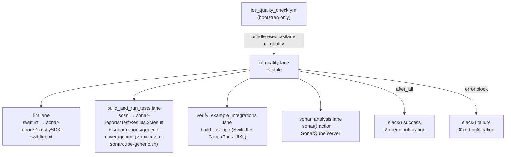

# DEV-305935 PR Quality Check — Fastlane, Ruby Setup & Slack — Design

**Spec:** `.specs/features/DEV-305935-ios-sdk-pr-quality-fastlane/spec.md`
**Context:** `.specs/features/DEV-305935-ios-sdk-pr-quality-fastlane/context.md`
**Status:** Approved

---

## Architecture Overview

All quality execution moves into Fastlane. The YAML becomes a thin bootstrap layer
(checkout, Xcode setup, Ruby setup, env vars) that calls a single lane:
`bundle exec fastlane ci_quality`. Slack notifications and SonarQube analysis live
entirely in the Fastfile. `run-sonar-swift.sh` is retired.

**Key insight from research:** `run-sonar-swift.sh` runs its own independent
`xcodebuild clean build test` with `-enableCodeCoverage YES` to produce the
`.xcresult`. This means the current workflow runs tests **twice**. Approach A
eliminates the double run by having `scan` (in `build_and_run_tests`) produce the
`.xcresult` at a known path; `sonar_analysis` consumes it.



---

## YAML → Fastfile Responsibility Split

| Step | Owner | Notes |
|---|---|---|
| `actions/checkout` | YAML | No Fastlane equivalent |
| `Get Git Revision` | YAML | Produces `GIT_REVISION` env var for `sonar.scm.revision` |
| `maxim-lobanov/setup-xcode` | YAML | GitHub Action; must precede Fastlane |
| `ruby/setup-ruby@v1` | YAML | Must run before `bundle exec` |
| `brew install swiftlint` | YAML | Pre-requisite for lint lane; simpler to keep in YAML |
| `brew install sonar-scanner` | YAML | Pre-requisite for sonar lane; simpler to keep in YAML |
| Reset SonarScanner cache | YAML | `rm -rf ~/.sonar/cache` — one-liner; no value moving to Fastlane |
| Xcode dependencies setup | YAML | `xcode-select` + `runFirstLaunch` — infra, not quality |
| lint → tests → verify → sonar → Slack | **Fastfile** | All quality execution |

> **Design decision on brew installs:** Moving `brew install` calls to `sh()` inside
> a setup lane adds complexity (error handling, idempotency) with no measurable benefit.
> Keeping them in YAML as infrastructure steps is cleaner and consistent with the
> existing pattern for `actions/checkout` and `setup-xcode`. This is agent discretion
> per `context.md`.

---

## Components

### 1. `ci_quality` lane (new — orchestrator)

- **Purpose:** Single CI entry point. Calls all quality lanes in order; `after_all`
  and `error` blocks at the platform level handle Slack notifications.
- **Location:** `fastlane/Fastfile`
- **Interface:**
  ```ruby
  lane :ci_quality do
    lint
    build_and_run_tests   # enhanced — now also produces .xcresult + coverage XML
    verify_example_integrations
    sonar_analysis
  end
  ```
- **Dependencies:** `lint`, `build_and_run_tests`, `verify_example_integrations`,
  `sonar_analysis` lanes; `SLACK_URL`, `GITHUB_*` env vars (injected from YAML)
- **Reuses:** All four existing/new lanes

---

### 2. `build_and_run_tests` lane (modified)

- **Purpose:** Build and run unit tests AND produce the `.xcresult` bundle that
  `sonar_analysis` consumes for coverage. Eliminates the double test run from
  the old `run-sonar-swift.sh` flow.
- **Location:** `fastlane/Fastfile`
- **Interface:**
  ```ruby
  lane :build_and_run_tests do
    scan(
      workspace: "./TrustlySDK.xcworkspace",
      scheme: "TrustlySDK",
      devices: ["iPhone 16"],
      clean: true,
      code_coverage: true,
      derived_data_path: "sonar-reports/",
      result_bundle: true,
      result_bundle_path: "sonar-reports/TestResults.xcresult",
      output_directory: "sonar-reports/"
    )
  end
  ```
- **Dependencies:** `scan` action (fastlane built-in)
- **Output contract:** `sonar-reports/TestResults.xcresult` MUST exist after this
  lane completes. `sonar_analysis` reads it.
- **Risk:** `scan` with `result_bundle: true` + `derived_data_path` must produce an
  `.xcresult` readable by `xcrun xccov view --archive`. **Must be validated in CI
  on a test branch before merging.** See Risks & Concerns.

---

### 3. `sonar_analysis` lane (new)

- **Purpose:** Generate coverage XML from the `.xcresult`, verify it, run SonarQube
  analysis. Replaces `run-sonar-swift.sh`.
- **Location:** `fastlane/Fastfile`
- **Interface:**
  ```ruby
  lane :sonar_analysis do
    xcresult_path = "sonar-reports/TestResults.xcresult"

    # 1. Generate coverage XML
    sh("bash xccov-to-sonarqube-generic.sh #{xcresult_path} > sonar-reports/generic-coverage.xml")

    # 2. Verify coverage XML exists and is non-empty
    UI.user_error!("Coverage report not found!") unless File.exist?("sonar-reports/generic-coverage.xml")
    UI.user_error!("Coverage report is empty!") if File.zero?("sonar-reports/generic-coverage.xml")

    # 3. Run SonarQube analysis
    sonar(
      project_key: ENV["SONAR_PROJECT_KEY"],
      project_name: ENV["SONAR_PROJECT_NAME"],
      sonar_url: ENV["SONAR_HOST_URL"],
      sonar_token: ENV["SONAR_TOKEN"],
      sonar_runner_args: [
        "-Dsonar.pullrequest.key=#{ENV['PR_NUMBER']}",
        "-Dsonar.pullrequest.branch=#{ENV['BRANCH_ORIGIN']}",
        "-Dsonar.pullrequest.base=#{ENV['BASE_BRANCH']}",
        "-Dsonar.scm.revision=#{ENV['GIT_REVISION']}",
        "-Dsonar.coverageReportPaths=sonar-reports/generic-coverage.xml"
      ].join(" ")
    )
  end
  ```
- **Dependencies:** `xccov-to-sonarqube-generic.sh` (repo root), `sonar` action
  (fastlane built-in), env vars from YAML (`SONAR_PROJECT_KEY`, `SONAR_PROJECT_NAME`,
  `SONAR_HOST_URL`, `SONAR_TOKEN`, `PR_NUMBER`, `BRANCH_ORIGIN`, `BASE_BRANCH`,
  `GIT_REVISION`)
- **Input contract:** `sonar-reports/TestResults.xcresult` must exist (produced by
  `build_and_run_tests`)

> **Note on `sonar_runner_args`:** Fastlane's `sonar()` action does not have
> dedicated parameters for `sonar.pullrequest.*` or `sonar.coverageReportPaths`.
> These are passed via `sonar_runner_args` as `-Dkey=value` strings, which
> the action appends to the sonar-scanner invocation. Confirmed via Context7 docs.

---

### 4. `lint` lane (unchanged)

- **Purpose:** Run SwiftLint, write output to `sonar-reports/TrustlySDK-swiftlint.txt`.
- **Location:** `fastlane/Fastfile`
- **No changes needed.** `ignore_exit_status: true` preserved (see Risks & Concerns
  for the trade-off note).

---

### 5. `verify_example_integrations` lane (unchanged)

- **Purpose:** Build SwiftUI and UIKit example apps.
- **Location:** `fastlane/Fastfile`
- **No changes needed.**

---

### 6. Platform-level `after_all` + `error` blocks (new)

- **Purpose:** Send Slack notifications on CI run success or failure.
- **Location:** `fastlane/Fastfile`, inside `platform :ios do`
- **Interface:**
  ```ruby
  after_all do |lane|
    next unless lane == :ci_quality
    slack(
      message: "✅ [iOS SDK] Build succeeded",
      success: true,
      default_payloads: [],
      payload: {
        "Repo"   => ENV["GITHUB_REPOSITORY"],
        "Actor"  => ENV["GITHUB_ACTOR"],
        "Run"    => "#{ENV['GITHUB_SERVER_URL']}/#{ENV['GITHUB_REPOSITORY']}/actions/runs/#{ENV['GITHUB_RUN_ID']}"
      }
    )
  end

  error do |lane, exception|
    next unless lane == :ci_quality
    slack(
      message: "❌ [iOS SDK] Build failed",
      success: false,
      default_payloads: [],
      payload: {
        "Repo"   => ENV["GITHUB_REPOSITORY"],
        "Actor"  => ENV["GITHUB_ACTOR"],
        "Run"    => "#{ENV['GITHUB_SERVER_URL']}/#{ENV['GITHUB_REPOSITORY']}/actions/runs/#{ENV['GITHUB_RUN_ID']}"
      }
    )
  end
  ```
- **Scope guard:** `next unless lane == :ci_quality` prevents Slack from firing for
  `publish`, `lint`, or any other lane run individually.
- **Dependencies:** `SLACK_URL` env var (read automatically by `slack()` action),
  `GITHUB_*` env vars injected from YAML.

---

### 7. `ios_quality_check.yml` (modified)

- **Purpose:** Bootstrap layer. Replaces multi-step execution with a single Fastlane call.
- **Location:** `.github/workflows/ios_quality_check.yml`
- **Final step order:**
  ```
  checkout →
  Get Git Revision →
  Setup Xcode →
  Set up Ruby (ruby/setup-ruby@v1) →
  Install dependencies (brew: swiftlint, sonar-scanner + xcode-select) →
  Install sonar-scanner →
  Reset SonarScanner cache →
  Run CI Quality (bundle exec fastlane ci_quality)   ← single Fastlane step
  ```
- **Env vars passed to the Fastlane step:**
  ```yaml
  - name: Run CI Quality
    env:
      SONAR_PROJECT_KEY: ${{ env.SONAR_PROJECT_KEY }}
      SONAR_PROJECT_NAME: ${{ env.SONAR_PROJECT_NAME }}
      SONAR_HOST_URL: ${{ env.SONAR_HOST_URL }}
      SONAR_TOKEN: ${{ secrets.SONAR_TOKEN_SECRET }}
      PR_NUMBER: ${{ github.event.number }}
      BRANCH_ORIGIN: ${{ github.head_ref }}
      BASE_BRANCH: ${{ github.base_ref }}
      GIT_REVISION: ${{ env.GIT_REVISION }}
      SLACK_URL: ${{ secrets.SLACK_WEBHOOK_URL }}
      GITHUB_REPOSITORY: ${{ github.repository }}
      GITHUB_ACTOR: ${{ github.actor }}
      GITHUB_RUN_ID: ${{ github.run_id }}
      GITHUB_SERVER_URL: ${{ github.server_url }}
    run: bundle exec fastlane ci_quality
  ```
- **Removed from YAML:** sonar property injection step, `run-sonar-swift.sh` step,
  `Verify Coverage Report` step, both commented-out Slack steps.

---

## Code Reuse Analysis

### Existing Components to Leverage

| Component | Location | How to Use |
|---|---|---|
| `lint` lane | `fastlane/Fastfile:66` | Call unchanged from `ci_quality` |
| `verify_example_integrations` lane | `fastlane/Fastfile:59` | Call unchanged from `ci_quality` |
| `build_and_run_tests` lane | `fastlane/Fastfile:14` | Extend with `result_bundle`, `derived_data_path`, `code_coverage` params |
| `xccov-to-sonarqube-generic.sh` | repo root | Call via `sh()` inside `sonar_analysis` lane |
| `sonar-project.properties` | repo root | Read by `sonar()` action as base config; lane overrides PR-specific params via `sonar_runner_args` |
| `ruby/setup-ruby@v1` step | `ios_quality_check.yml:46` | Already present — no change |
| Existing env vars (`PR_NUMBER`, `BRANCH_ORIGIN`, etc.) | `ios_quality_check.yml` env block | Re-exposed to Fastlane step via `env:` on the run step |

### Integration Points

| System | Integration Method |
|---|---|
| SonarQube (`sonarqube.trustly.one`) | `sonar()` action with `sonar_runner_args` for PR decoration |
| Slack (incoming webhook) | `slack()` action reads `SLACK_URL` env var automatically |
| GitHub Actions env context | Env vars injected from YAML into the `bundle exec fastlane ci_quality` step |
| `xccov-to-sonarqube-generic.sh` | `sh("bash xccov-to-sonarqube-generic.sh <path> > sonar-reports/generic-coverage.xml")` |

---

## Error Handling Strategy

| Error Scenario | Handling | User Impact |
|---|---|---|
| Any Fastlane lane raises exception | Platform-level `error` block fires Slack failure notification; job exits non-zero | Red Slack notification immediately |
| `sonar-reports/TestResults.xcresult` absent | `UI.user_error!` in `sonar_analysis` — raises exception → `error` block fires | Red Slack notification + clear error in CI log |
| `sonar-reports/generic-coverage.xml` absent or empty | `UI.user_error!` in `sonar_analysis` — raises exception → `error` block fires | Red Slack notification + "Coverage report not found!" in CI log |
| `SLACK_URL` not configured | `slack()` action fails with a clear error (action behavior); does NOT expose the secret | CI step fails with descriptive message |
| `sonar()` analysis fails | Raises exception → `error` block fires Slack failure | Red Slack notification |
| SwiftLint violations | `ignore_exit_status: true` — does NOT fail the lane (see Risks) | No notification; violations recorded in report file only |

---

## Risks & Concerns

| Concern | Location | Impact | Mitigation |
|---|---|---|---|
| `scan` + `result_bundle` xcresult compatibility with `xccov-to-sonarqube-generic.sh` | `fastlane/Fastfile` (build_and_run_tests) | If `scan`'s xcresult is not readable by `xcrun xccov view --archive`, coverage generation fails | **Validate on a test CI run before merging.** The `sonar_analysis` lane's `sh()` call for `xccov-to-sonarqube-generic.sh` uses `--archive` flag (same as `run-sonar-swift.sh`). If incompatible, fallback: keep `run-sonar-swift.sh` for the xcodebuild+coverage step only (Approach B). |
| `sonar_runner_args` string escaping | `fastlane/Fastfile` (sonar_analysis) | Special characters in branch names (e.g. `/`) may break the `-D` arg string | Use `URI.encode_www_form_component` for branch name values, or verify branch names are alphanumeric-plus-slash only (as in practice for this repo) |
| `lint` lane uses `ignore_exit_status: true` | `fastlane/Fastfile:69` | SwiftLint violations do NOT fail the lane — silent quality degradation | Documented trade-off (from context.md). Not changed in this ticket. Follow-up ticket to harden if desired. |
| Double-`SONAR_USER_HOME` reset | `ios_quality_check.yml` | Cache reset step in YAML sets `SONAR_USER_HOME`; the `sonar()` action also sets it internally | Pass `SONAR_USER_HOME: ${{ runner.temp }}/.sonar` as an env var on the `bundle exec fastlane ci_quality` step to ensure consistency |
| `after_all` fires for ALL lanes, not just `ci_quality` | `fastlane/Fastfile` | If someone runs `fastlane lint` locally, Slack fires unexpectedly | Scope guard: `next unless lane == :ci_quality` in both `after_all` and `error` blocks |

---

## Tech Decisions

| Decision | Choice | Rationale |
|---|---|---|
| Single test run via `scan` | `result_bundle: true` + `derived_data_path: "sonar-reports/"` | Eliminates duplicate `xcodebuild` run from `run-sonar-swift.sh`; saves ~5–10 min CI time |
| `sonar_runner_args` for PR decoration | Pass as `-Dkey=value` string | Fastlane `sonar()` action has no dedicated PR params; `sonar_runner_args` is the documented extension point |
| Platform-level `after_all`/`error` with scope guard | `next unless lane == :ci_quality` | Prevents Slack firing for local/individual lane runs; cleaner than per-lane hooks |
| `slack()` reads `SLACK_URL` automatically | No explicit `slack_url:` param needed | Fastlane `slack()` reads `SLACK_URL` env var by default — passing it via YAML env is sufficient |
| brew installs stay in YAML | Keep as YAML steps | Infrastructure, not quality logic; moving to `sh()` adds no value and complicates error handling |
| `sonar-project.properties` unchanged | Read as base by `sonar()` action | All project-level config (sources, tests, exclusions) stays in the properties file; only CI-dynamic params go via `sonar_runner_args` |

> **Project-level decision update:** AD-001 is superseded by this design.
> The new standard is broader: **all quality execution (lint, test, coverage, sonar, notifications)
> runs through Fastlane**. Updated below.

---

## STATE.md Update Required

AD-001 must be updated to reflect the expanded scope. See Tasks.
