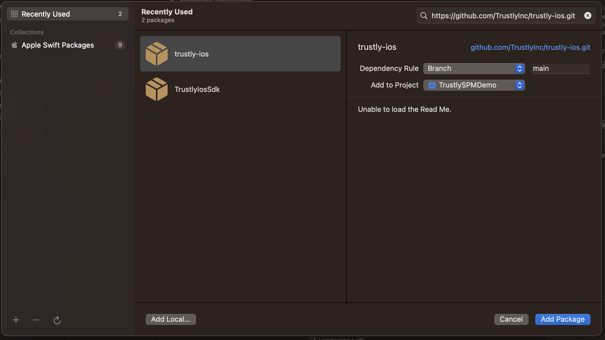

# TrustlySDK

[](https://cocoapods.org/pods/TrustlySDK)
[](https://cocoapods.org/pods/TrustlySDK)
[](https://cocoapods.org/pods/TrustlySDK)
[](https://cocoapods.org/pods/TrustlySDK)
[](https://cocoapods.org/pods/TrustlySDK)
[](https://cocoapods.org/pods/TrustlySDK)

## Example App
---
To run the example project, clone the repo, and run `pod install` from the Example directory first.

## Requirements
---
- iOS 12 or higher

## Installation
---
<details open>
<summary>Cocoapods</summary>
<br />

TrustlySDK is available through [CocoaPods](https://cocoapods.org). To install
it, simply add the following line to your Podfile:

```ruby
pod 'TrustlySDK'
```

For development and test reasons, you can install the pod from a branch in github:
```ruby
pod 'TrustlySDK', :git => 'https://github.com/TrustlyInc/trustly-ios.git', :branch => '<BRANCH_NAME>'
```
</details>

<details open>
<summary>Swift Package Manager - SPM</summary>
<br />
TrustlySDK is available through [Swift Package Manager](https://cocoapods.org). To install
it, simply click on File -> Add packages -> Search or Enter Package URL, paste the github url about this package `https://github.com/TrustlyInc/trustly-ios.git`:



For production reason choose the `main` branch, but for test or validation choose the branch described in the [release version table](#versions).
</details>
<br />

## Usage

To quickly get up and running with this SDK see the [iOS Quickstart](https://amer.developers.trustly.com/payments/docs/ios-quickstart) in the Trustly Developer Documentation.


<br />

## Versions
___

| VERSION   | DESCRIPTION   | BRANCH |
| :-------: | :-----------  | :----------- |
4.0.0     | Change the SDK design to work with controllers | *main*
3.3.1     | Fix bug when try to send metadata properties | *main*
3.3.0     | Implement the functionality of being able to choose webview or in-app browser in the SDK | *main*
3.2.3     | Fix a bug when we try to send an establish data with an array value | *main*
3.2.2     | Fix a bug when we try to check if the sdk is loading a error page(400 and 500) | *main*
3.2.1     | Prepare the sdk to support Buck build system | *main*
3.2.0     | Add PrivacyInfo.xcprivacy | *main*
3.1.1     | Fix minor bug when use the SDK in local environment | *main*
3.1.0     | Add SessionCid to to distinct widget impressions and transactions | *main*
3.0.0     | Add cocoapods, and swift package manager support | *main*


<br />

## License
___

TrustlySDK is available under the MIT license. See the LICENSE file for more info.
